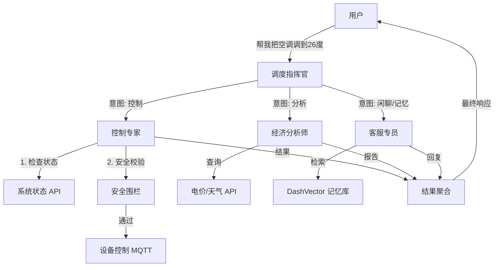

# AI-HEMS 企业级多 Agent 架构设计文档

## 1. 架构概览

为了将 AI-HEMS (家庭能源管理系统) 升级为企业级解决方案，我们采用 **Router-Specialist (路由器-专家)** 模式。这种架构通过职责分离，解决了单体 Prompt 的上下文污染问题，提高了系统的安全性、可维护性和响应速度。

### 核心设计原则
1.  **安全优先 (Safety First)**：控制类操作必须经过确定性校验层 (Guardrails)。
2.  **职责单一 (Single Responsibility)**：每个 Agent 只专注于一类任务。
3.  **状态隔离 (State Isolation)**：长期记忆 (RAG) 与短期对话上下文分离。
4.  **可扩展性 (Scalability)**：易于添加新的专家 Agent (如：EV 充电优化专家)。

---

## 2. 系统组件与 Agent 定义

系统由 1 个中央调度器和 3 个核心专家 Agent 组成。

### 2.1 调度指挥官 (Router / Orchestrator Agent)
*   **角色**：系统的统一入口和大脑。
*   **职责**：
    *   接收用户自然语言指令。
    *   **意图识别 (Intent Classification)**：判断用户是想查询状态、控制设备、分析收益，还是闲聊。
    *   **上下文管理**：维护当前会话的全局状态 (Session Context)。
    *   **任务分发**：将请求路由给最合适的 Specialist Agent。
*   **输入**：用户 Query + 历史摘要。
*   **输出**：目标 Agent ID + 提取的参数。

### 2.2 设备控制专家 (Control Agent) —— *Security Tier 1*
*   **角色**：执行物理操作的执行者。
*   **职责**：
    *   调用 `set_energy_strategy` (ECO/UPS/FAST/GREEN)。
    *   直接控制设备 (Turn On/Off AC, Start Charging)。
    *   **安全校验 (Guardrails)**：在调用底层 MQTT/API 前，必须通过硬编码的安全检查 (例如：电池 < 10% 禁止强制放电)。
*   **工具权限**：`get_system_status`, `set_energy_strategy`, `control_device`.
*   **Prompt 特点**：极度严谨，禁止幻觉，输出必须包含操作原因。

### 2.3 经济分析师 (Analyst Agent)
*   **角色**：数据分析与策略优化专家。
*   **职责**：
    *   查询电价数据 (ToU Rates)。
    *   查询天气预报 (Solar Forecast)。
    *   计算当前策略的经济收益 (Savings Calculation)。
    *   生成优化建议 (Optimization Proposal)。
*   **工具权限**：`get_market_info`, `get_weather`, `calculate_savings`, `query_history`.
*   **Prompt 特点**：擅长数学计算和数据分析，输出结构化报表。

### 2.4 用户服务专员 (Support Agent)
*   **角色**：系统的“客服”和记忆管家。
*   **职责**：
    *   处理非设备类的一般性问答 (FAQ)。
    *   **长期记忆 (RAG)**：负责从 Vector Store 中检索用户偏好 (例如：“我周五回家需要快充”)。
    *   解释专业术语 (例如：“什么是 DoD？”)。
*   **工具权限**：`memory_recall`, `memory_store`, `web_search` (可选)。
*   **Prompt 特点**：语气亲切，善于共情，知识库丰富。

---

## 3. 交互流程 (Workflow)



---

## 4. 目录结构规划

建议重构 `app/core` 目录以支持多 Agent：

```text
app/
├── core/
│   ├── agents/                 # 新增：Agent 模块
│   │   ├── __init__.py
│   │   ├── base.py             # Agent 基类 (定义统一接口)
│   │   ├── router.py           # 调度器实现
│   │   ├── control.py          # 控制专家
│   │   ├── analyst.py          # 分析师
│   │   └── support.py          # 客服专员
│   ├── safety/                 # 新增：安全层
│   │   ├── __init__.py
│   │   └── guardrails.py       # 确定性规则 (Deterministic Rules)
│   ├── llm_service.py          # 重构：作为 Agent 的运行环境/宿主
│   └── memory_service.py       # 现有的记忆服务
```

## 5. 技术栈演进

*   **当前**：OpenAI SDK (Monolithic)
*   **目标**：
    *   **Orchestration**：手动实现的 Router 模式 (轻量级，易于控制)。
    *   **Model**：
        *   Router & Analyst: `qwen-plus` (均衡)。
        *   Control Agent: `qwen-max` (高智商，保证指令准确)。
        *   Support Agent: `qwen-turbo` (快速，低成本)。
    *   **Memory**：DashVector (已验证) + Redis (可选，用于短期会话缓存)。

## 6. 下一步实施计划

1.  **基础设施准备**：建立 `app/core/agents` 目录和 `BaseAgent` 类。
2.  **拆分 Prompt**：将现有的巨型 Prompt 拆分为 4 个精简 Prompt。
3.  **实现 Router**：编写意图识别逻辑。
4.  **迁移功能**：将 `LLMService` 中的工具调用逻辑迁移到对应的 Agent 中。
5.  **集成测试**：验证跨 Agent 的协作流程。
